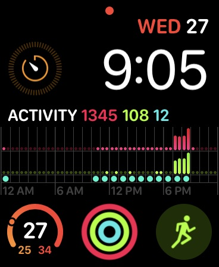

# Apple Watch Series 4

I own the Apple Watch Series 4 44mm Aluminum.

Overall review:

* It's just a watch. Nothing fancy, and nice to have.
* Most things you can already do on your phone
  * But my phone is already a distracting device, so let's limit me even accessing it

Pros:

* Removes me from the addiction/distraction of my phone
* Easy access to a timer
  * I usually set timers so that I can help focus for a certain period of time
  * Notify myself when I need to do something in X minutes
    * For example: Remind me that I need to leave in 40 minutes
* Health tracking keeps me accountable when used with exercise

Cons:

* Requires an iPhone
* Enabling DND in watch, also enable it on phone. Alternative is to use Airplane mode
* Airplane mode doesn’t have similar DND feature if “Turn off in 1 hour”
* Glass seems to get easily scratched

Uses:

* Airplane mode
  * For when I want my watch on to track my health, but not be distracted by notifications

#### Apple Watch Series 4 vs Apple Watch Series 3

Apple Watch Series 4 44m:

* Larger screen size
* Can fit more text on screen
* Easier to read notifications
* Thinner, and personally I find it more aesthetically better looking

