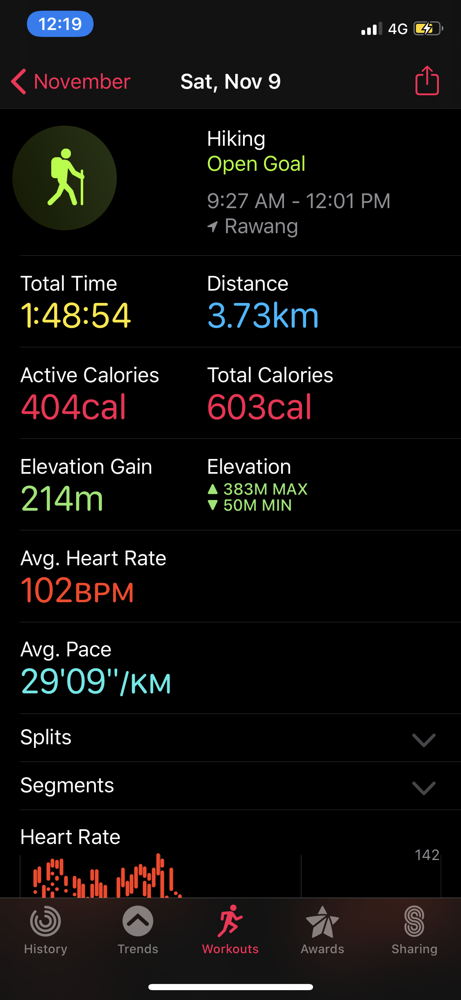

# Kanching Waterfalls

Location:

* [https://goo.gl/maps/3azHaaERdboqNooo7](https://goo.gl/maps/3azHaaERdboqNooo7)
* Distance from KL: 30mins

Hiking to the top: Less than 1hour

* Two different sections: Paved, and unpaved
* Paved:
  * Cement stairs
* Unpaved:
  * Jungle and mossy rocks

Entrance fee \(paid at parking entrance\): 

* RM2/car
* RM2/person

Resources:

* [http://waterfallsofmalaysia.com/01kanching.php](http://waterfallsofmalaysia.com/01kanching.php)
* [https://www.malaysia-traveller.com/kanching.html](https://www.malaysia-traveller.com/kanching.html)
* [https://thewanderinglinguist.com/2018/06/27/kanching-falls/](https://thewanderinglinguist.com/2018/06/27/kanching-falls/)
* [https://www.tripadvisor.com.my/Attraction\_Review-g298570-d1438257-Reviews-Kanching\_Rainforest\_Waterfall-Kuala\_Lumpur\_Wilayah\_Persekutuan.html](https://www.tripadvisor.com.my/Attraction_Review-g298570-d1438257-Reviews-Kanching_Rainforest_Waterfall-Kuala_Lumpur_Wilayah_Persekutuan.html)
* [https://www.alltrails.com/trail/malaysia/selangor/kanching-waterfalls](https://www.alltrails.com/trail/malaysia/selangor/kanching-waterfalls)
* Instagram
  * [https://www.instagram.com/explore/locations/983695748/kanching-falls/](https://www.instagram.com/explore/locations/983695748/kanching-falls/)
  * [https://www.instagram.com/explore/tags/kanchingfalls/](https://www.instagram.com/explore/tags/kanchingfalls/)
* YouTube
  * [https://www.youtube.com/results?search\_query=kanching+falls](https://www.youtube.com/results?search_query=kanching+falls)

