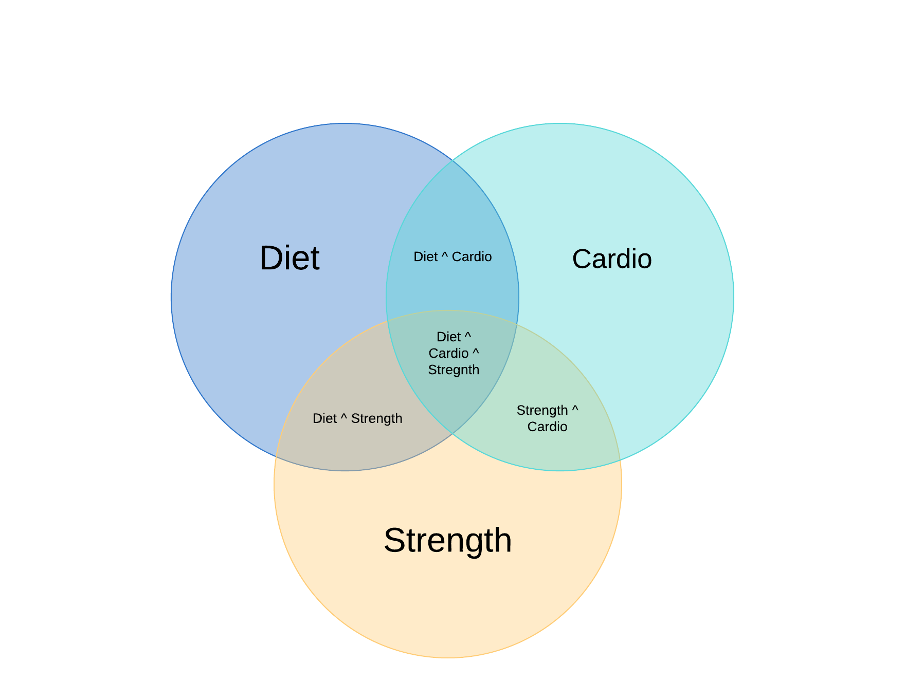

# Physical Health

There are three ways to lose weight:

* Diet
* Cardio
* Physical Training

## Diet

Just doing a diet alone doesn't strengthen any of your muscles.

Pros:

* Get the correct nutrition your body needs
* Can reduce weight without physical effort

Cons:

* Doesn't build your heart muscle
* Doesn't strengthen your muscles

Examples:

* Elliptical
* Running

## Cardio

* Great for long term \(decades\) health

Pros:

* Great short term boost to reducing weight
* Builds your heart muscle

Cons:

* Doesn't strengthen your other muscles

## Muscle Training Exercises

Also known as:

* Strength Training

Properties:

* Great for short term \(months or years\) health

Pros:

* Builds muscles
* Muscles burn more calories at rest
  * Longer term burn of calories

Cons:

* Doesn't strengthen heart

